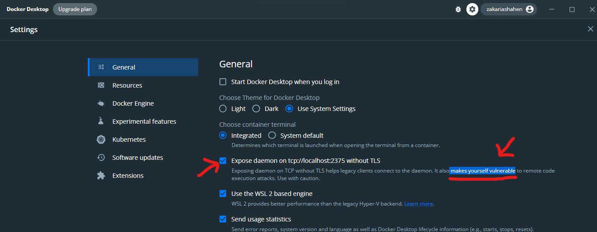

### First Microservice app

### How to build image 

#### build image with docker-maven plugin (**deprecated**)

1. `git checkout dockerfile-maven-plugin`
2. Enable docker expose daemon (**but makes yourself vulnerable**)
   -  

3. run next command
    ```shell
      ./mvnw clean package dockerfile:build
    ```


#### build image with spring-boot:build-image plugin

1. run next commands
   ```shell
      ./mvnw clean spring:build-image
   ```


#### run service with docker-compose

1. build config server image via [repo link](https://github.com/zakaria-shahen/firstspringconfigurationserver)
2. run next command
   ```shell
      docker-compose up
   ```
3. vault config

### Vault Config

[//]: # (TODO: move to docker-compose - run script after runing vault)

- run in vault container terminal
  ```shell
    vault login token=myroot
    vault kv put secret/firstmicroservice  test.vault="Hello, Vault"
  ```

#### refresh config link

- POST [http://localhost:8080/refresh](http://localhost:8080/refresh)


### NOTE: if run with Eureka client config in your localhost (pc) without docker and your host (pc) installed docker-desktop.. problem may occur.. [link](https://stackoverflow.com/a/63283687/15107127)